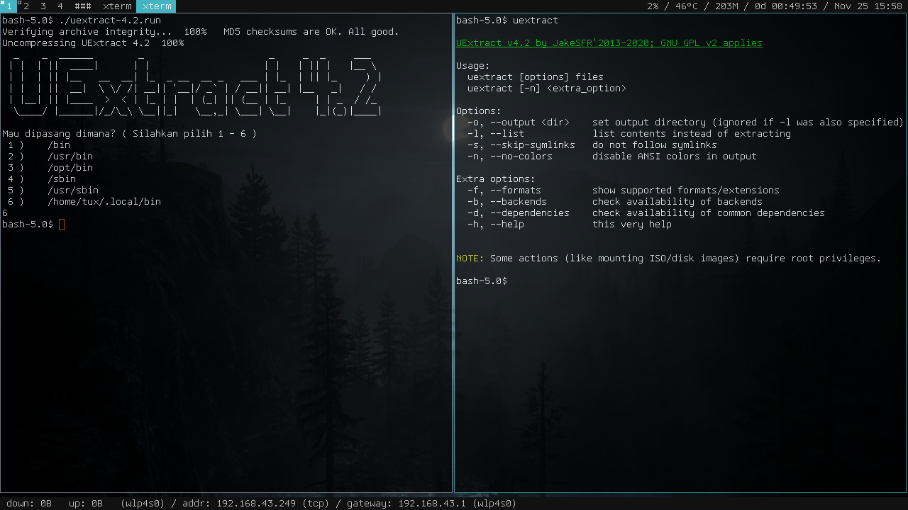

UExtract 4.2
============
uextract adalah alat untuk mengekstrak file arsip apa saja. [uextract](src/uextract) berasal dari [forum Puppy Linux](http://www.murga-linux.com/puppy/viewtopic.php?t=87864). Tetapi dapat digunakan di semua distro Linux.

Penggunaan
----------
Ekstrak:
    $ uextract file.tar.gz
    $ uextract file.deb

Melihat daftar isi arsip (tidak mengekstrak):
    $ uextract -l file.zip

Cek ketersediaan backend:
    $ uextract -b

Screenshot
----------

